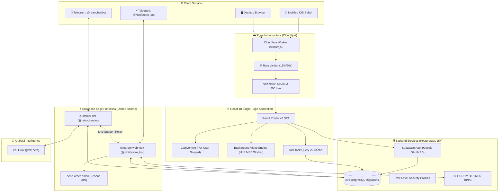
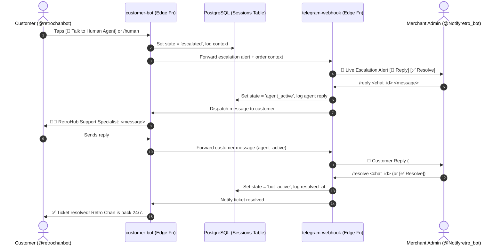

# RETROHUB — Digital Goods, Game Keys & In-Game Commerce Platform 🎮⚡

<p align="center">
  
</p>

<p align="center">
  <b>Enterprise-Grade Digital Goods E-Commerce Platform & Dual-Bot Telegram Command Engine</b><br>
  <i>Engineered with React 18, TypeScript, Tailwind CSS, Supabase (PostgreSQL 15+), xAI Grok, and Cloudflare Workers.</i>
</p>

<p align="center">
  
  =22" />
  
  
  
  
  
  
</p>

---

## 📖 Executive Summary

**RETROHUB** is a high-performance digital commerce platform engineered for instant delivery of digital game keys, in-game currency top-ups, verified gaming accounts, digital gift cards, subscription passes, and software licenses.

Architected specifically for modern digital merchants, RetroHub couples an ultra-fast, zero-LCP cyber-neon storefront with a **dual-bot Telegram orchestration engine** that completely automates order triage, customer support, and mobile phone fulfillment.

> **Developer & Lead Architect:** Abir Hossain  
> **Repository:** [https://github.com/abirthe/retrohub.git](https://github.com/abirthe/retrohub.git)  
> **Production Branch:** `main`  
> **Latest Release:** [v1.3.0 (Changelog)](CHANGELOG.md)

---

## 🏛️ System Architecture Topology



---

## ⚡ Core Features & Capabilities

### 1. Storefront & Product Discovery
* **8 Curated Digital Categories**:
  * 🖥️ **PC Games** (Steam, Epic Games, GOG, EA App, Ubisoft Connect)
  * 🎮 **Console Games** (PlayStation Network, Xbox Live, Nintendo eShop)
  * 💎 **In-Game Top-Ups** (Valorant Points, MLBB Diamonds, PUBG UC, Genshin Crystals, Free Fire, Robux)
  * 🎁 **Digital Gift Cards** (Apple iTunes, Steam Wallet, PSN Wallet, Xbox, Nintendo, Google Play)
  * 🛡️ **Verified Gaming Accounts** (Regional and verified accounts)
  * 🔄 **Subscriptions & Passes** (Xbox Game Pass Ultimate, PlayStation Plus, EA Play, Discord Nitro, Telegram Premium)
  * 💻 **Software & Services** (Windows/Office keys, Google AI Pro, regional account setups)
* **Strict Regional Taxonomy**: 28 regional flags and tags (Global, US, TR, ARG, IN, EU, etc.) preventing regional redemption errors.
* **Instant Dynamic Search**: Fast text filtering with atomic query debouncing and zero layout shift.

---

### 2. Cart, Checkout & Player UID Capture
* **Per-User Cart Isolation**: `CartContext` dynamically scopes cart storage to `cart_${userId}` for authenticated users and `cart_guest` for visitors, eliminating cross-account cart leakage when shared devices switch Google logins.
* **Frictionless Guest Review**: Anonymous visitors can build carts, calculate totals, specify Player UIDs, and review orders without aggressive barrier prompts.
* **Player UID / Server Requirements**: Dynamically prompts and validates mandatory game identification fields (e.g. Player ID + Server Zone) for in-game top-ups before checkout.
* **Authoritative Price Enforcement**: Product sale prices and stock availability are re-queried and validated directly against database rows upon order creation in [`orderApi.ts`](src/lib/orderApi.ts), preventing client-side DOM price tampering.

---

### 3. Payment Processing & bKash Anti-Fraud Engine
* **Dedicated bKash Payment Portal (`/payment`)**: Seamless walkthrough with 1-click copy for merchant and personal numbers, plus automated 1.0% charge calculation.
* **Atomic `SECURITY DEFINER` Payment RPC**: Routes transaction submissions through `submit_order_payment`, enforcing caller ownership (`user_id = auth.uid()`), alphanumeric regex format validation (`/^[A-Z0-9]{6,30}$/i`), and transitioning status to `payment_submitted` without exposing table `UPDATE` rights.
* **Duplicate TrxID Fraud Detection**: The system validates Transaction IDs against historical submissions, flagging attempted reuse and warning merchants instantly.

---

### 4. Customer Order History & Digital Code Reveal (`/orders`)
* **Live Order Lifecycle Tracking**: Real-time visual progress across all 7 statuses: `pending` → `payment_submitted` → `payment_verified` → `sourcing` → `fulfilled` (or `cancelled`/`refunded`).
* **Interactive Code Reveal**: Immediately unveils redeemed digital keys, license vouchers, or login credentials upon fulfillment with 1-click clipboard copy.
* **Redemption Guides**: Integrated platform activation instructions tailored to the specific product platform.

---

### 5. On-Demand Custom Orders (`/custom-order`)
* **Dedicated Procurement Board**: Allows customers to request unlisted games, foreign regional editions, or rare digital subscriptions.
* **Instant Merchant Dispatch**: Submissions alert the merchant via Telegram with customer contact information, game title, and specific notes.

---

### 6. Merchant Back-Office Control Center (`/admin`)
* **Role-Gated Security**: Secured by Supabase Row-Level Security and `public.has_role(auth.uid(), 'admin')`.
* **Real-Time Financial KPI Views**:
  * 💰 **Today's Gross Revenue (৳)**: Aggregated gross value from fulfilled and verified orders today.
  * 📈 **Real-Time Net Profit (৳)**: Calculated as $\sum (\text{Sale Price} - \text{Cost Price})$.
  * 📦 **Daily Order Volume**: Total orders processed today.
  * ⏳ **Action Items Queue**: Live counter of orders awaiting verification or fulfillment.
* **Order Management Suite**: Single-click actions to Verify Payment, Fulfill with Key, Place on Hold, Cancel and Release Stock, or Issue Refunds.
* **Audit Trail**: Every admin decision logs the executing user ID, before/after statuses, timestamps, and reason notes into `admin_action_logs`.

---

## 🤖 Dual-Bot Telegram Orchestration Engine

RetroHub implements a decoupled, high-availability two-bot Telegram architecture:

```
               ┌────────────────────────────────────────────────────────┐
               │                    RETROHUB BACKEND                    │
               │              (PostgreSQL 15+ on Supabase)              │
               └───────────────▲────────────────────────▲───────────────┘
                               │                        │
            Public Triage & Order Inquiries     Role-Gated Fulfillment & Admin
                               │                        │
      ┌────────────────────────┴────────┐      ┌────────┴────────────────────────┐
      │          CUSTOMER BOT           │      │           ADMIN BOT             │
      │         @retrochanbot           │      │        @Notifyretro_bot         │
      │ (supabase/functions/customer-bot│      │(supabase/functions/telegram-web)│
      └────────────────▲────────────────┘      └────────────────▲────────────────┘
                       │                                        │
             Storefront Customers                        Merchant Admin
```

### 1. 💬 AI Customer Support Bot (`@retrochanbot`)
* **Persona**: *"Retro Chan"* — witty, charming, empathetic, and highly knowledgeable about all RetroHub products, platforms, and payment workflows.
* **Dual-Engine Customer Care Architecture**:
  * **Engine A (xAI Grok)**: Powered by `grok-2-latest` (with `grok-2` and `grok-beta` fallback) for conversational NLP, live order context injection, regional platform guidance, and empathetic problem solving.
  * **Engine B (Retro Chan Natural Intelligence Engine)**: Built-in local high-IQ knowledge engine providing sub-second answers on bKash payments (`01580382868`, 1% fee), instant delivery (1–15 min), order tracking, catalog highlights, and genuine key guarantees.
* **Zero-Interruption Invariant**: The merchant admin bot is **only alerted when a customer explicitly requests human assistance**. All customer service, order checks, and payment walkthroughs are handled 100% autonomously by the bot without bothering the merchant desk.
* **Instant Order Lookup**: Customers send an 8-character ID (e.g. `c7c482a2`) or full UUID to instantly retrieve order status, verification stage, and delivered keys.
* **Multi-Turn Session Table**: Persists conversations in `customer_support_sessions` with automated 20-message rolling memory.
* **Commands Registered**: `/start`, `/track [id]`, `/faq`, `/help`, `/human`.

### 2. ⚡ Merchant Admin Bot (`@Notifyretro_bot`)
* **Real-Time Push Alerts**: Pushes order creations, bKash TrxID submissions with duplicate fraud alerts, custom requests, and low stock warnings (≤ 3 keys).
* **Dual-Channel Dispatch**: Dispatched via Edge Function with an automated direct-client fallback, guaranteeing alert delivery during runtime cold starts.
* **One-Touch Mobile Inline Keyboards**: Verify or cancel orders on the go with a single tap.
* **15 Operational Commands**:
  * `/orders` — View 10 latest pending orders.
  * `/order <id>` or `/inspect <id>` — View full customer, phone, and order details.
  * `/verify <id>` — Mark bKash payment as verified.
  * `/deliver <id> <code>` — Fulfill order with digital key and send fulfillment email.
  * `/cancel <id> [reason]` — Cancel order and restore reserved stock.
  * `/hold <id> [reason]` — Place order on hold.
  * `/refund <id> [reason]` — Transition order to refunded.
  * `/summary` — Today's revenue, profit margin, orders, and pending items.
  * `/stock [search]` — Live inventory health report across all products.
  * `/custom` — Review custom order requests.
  * `/remind` — Trigger immediate scan for unfulfilled orders.
  * `/tickets` — View active escalated customer support sessions.
  * `/reply <chat_id> <msg>` — Send live support message to a customer.
  * `/resolve <chat_id>` — Resolve support ticket and return customer to AI bot.
  * `/help` — Command reference sheet.

### 3. 🤝 Bidirectional Live Support Relay (Human Assistance Bridge)
When a customer explicitly requests human assistance in `@retrochanbot`, the system bridges the customer directly to the merchant in `@Notifyretro_bot`:



* **Live Support Commands in Admin Bot**:
  * `/tickets` or `/support` — List all open customer support requests.
  * `/reply <chat_id> <message>` — Send a live message directly to that customer on Telegram.
  * `/resolve <chat_id>` — Resolve ticket and return the customer to Retro Chan AI.
  * `[💬 Reply]` *(Inline button)* — Tap-to-reply quick command generator.
  * `[✅ Mark Resolved]` *(Inline button)* — One-touch resolution from the alert message.

---

## ⚡ Performance Engineering & Core Web Vitals

RetroHub is engineered to pass all Google Core Web Vitals on real mobile devices:

| Metric | Measured Target | Optimization Applied |
| :--- | :--- | :--- |
| **Largest Contentful Paint (LCP)** | **< 300 ms** | Zero-weight GPU gradient hero in [HeroSection.tsx](src/components/home/HeroSection.tsx), eliminating 8.4s image decode bottlenecks. Decoupled video poster to prevent network blocking. |
| **Interaction to Next Paint (INP)** | **< 50 ms** | 8-way vendor chunking in Vite, `touch-action: manipulation` eliminating 300ms mobile tap delays, and React 18 `startTransition` on all filters. |
| **Cumulative Layout Shift (CLS)** | **0.00** | Geometric 8-card responsive skeleton grid matching exact card dimensions with pre-allocated layout heights. |
| **Asset Compression** | **96% Reduction** | Compressed favicon from 463 KB → 16.8 KB; static assets served with `Cache-Control: public, max-age=31536000, immutable`. |

### Universal Cross-Device Background Video Engine
* **MSE Web Worker Offloading**: `BackgroundAnimation.tsx` runs `hls.js` with transmuxing offloaded from the UI thread (`enableWorker: true`).
* **Mobile Play Sign Elimination**: Decoupled poster from `<video>` element, rendering an ambient CSS background fallback that completely prevents iOS Safari and mobile browsers from injecting native play button overlays (`::-webkit-media-controls-start-playback-button`).
* **Gesture Autoplay Recovery**: Global passive event listeners smoothly recover playback upon first touch or scroll if low-power mode defers video initialization.

---

## 🛡️ Security & Anti-Fraud Invariants

* **Role-Gated Admin Bot**: Commands verify incoming chat IDs against `ADMIN_CHAT_ID`, immediately rejecting foreign IDs.
* **Webhook Secret Header Verification**: Edge functions authenticate against `X-Telegram-Bot-Api-Secret-Token`.
* **Edge Rate Limiting**: Cloudflare Worker binding (`RATE_LIMITER`) limits traffic to 150 requests / 60 seconds per IP.
* **Zero Client Credential Leakage**: Service role keys and bot tokens are stored exclusively in server-side Supabase secrets.
* **Defensive Input Sanitization**: HTML entity escaping (`escapeHtml()`) applied to all dynamic Telegram and UI inputs.
* **Open Redirect Protection**: `AuthCallback.tsx` enforces strict origin matching on `returnTo` parameters.

---

## 📁 Repository Structure

```
retrohub/
├── .github/workflows/
│   ├── deploy-pages.yml              # CI/CD GitHub Pages deployment workflow
│   └── pending-orders-reminder.yml   # 24/7 automated 2-hour pending orders scanner
├── docs/
│   └── MERCHANT_SYSTEM_OVERVIEW.md   # Authoritative merchant specification manual
├── public/
│   ├── favicon.png                   # Optimized 16.8 KB storefront favicon
│   └── robots.txt                    # Search engine crawler directives
├── scripts/                          # Automated catalog and database toolchain
│   ├── database/                     # Migration execution & compiled SQL schemas
│   ├── images/                       # Cover art sourcing & watermark cleaners
│   ├── maintenance/                  # Deduplication, stock auditors & orphan cleaners
│   ├── pricing/                      # Market scrapers & margin synchronizers
│   ├── seeding/                      # Catalog seeders (games, gift cards, subs, top-ups)
│   └── README_SCRIPT.md              # 25+ script operations manual
├── src/
│   ├── components/
│   │   ├── admin/                    # Operations board, fulfill dialogs, KPI cards
│   │   ├── checkout/                 # Cart review, stock checks, UID inputs
│   │   ├── home/                     # HeroSection, CategoryBar, ProductGrid
│   │   ├── layout/                   # ShopHeader, Footer, Navigation, Ambient controls
│   │   ├── orders/                   # Order history table, status badges, code reveal
│   │   ├── payment/                  # bKash instruction card & payment form
│   │   ├── product/                  # ProductCard, ProductDetail, variant selectors
│   │   └── ui/                       # Radix UI & shadcn accessible primitives
│   ├── contexts/                     # CartContext (isolated per user UUID)
│   ├── hooks/                        # useAdmin, useAuth, useMobile, useToast
│   ├── integrations/supabase/        # Supabase client with production types
│   ├── lib/                          # Modular API clients, logger, formatters
│   ├── pages/                        # 11 lazy-loaded route views
│   └── test/                         # 27 unit tests across 3 suites
├── supabase/
│   ├── functions/
│   │   ├── customer-bot/             # AI Customer Support Bot (@retrochanbot)
│   │   ├── telegram-webhook/         # Merchant Admin Bot (@Notifyretro_bot)
│   │   └── send-order-email/         # Resend transactional email function
│   ├── migrations/                   # 29 versioned PostgreSQL migrations
│   └── README.md                     # Backend database & Edge Function manual
├── CHANGELOG.md                      # Version changelog (Keep a Changelog standard)
├── CONTRIBUTING.md                   # Contribution and workflow guide
├── package.json                      # Pinned dependencies & scripts
├── worker.js                         # Cloudflare Worker edge router & rate limiter
└── wrangler.json                     # Cloudflare Workers configuration
```

---

## 🚀 Quick Start Guide

### 1. Prerequisites
* **Node.js**: `>=22.0.0`
* **npm**: `>=9.0.0`
* **Supabase Account** with PostgreSQL 15+

### 2. Installation
```bash
git clone https://github.com/abirthe/retrohub.git
cd retrohub
npm install
```

### 3. Environment Setup
```bash
cp .env.example .env
```
Fill in your Supabase URL, Anon Key, Service Role Key, and Bot tokens.

### 4. Run Development Server
```bash
npm run dev
```
Open [http://localhost:3000](http://localhost:3000) in your browser.

### 5. Mandatory Validation
```bash
npx tsc --noEmit      # TypeScript check (0 errors)
npm run lint          # ESLint check (0 errors)
npm test              # Run Vitest suite (27 unit tests)
npm run build         # Production bundle compilation
```

---

## ☁️ Deployment Playbook

### Cloudflare Workers (Primary Production)
```bash
npx wrangler deploy
```
* Compiles static assets into `./dist`.
* `worker.js` enforces sliding-window IP rate limiting (150 req/60s) and handles SPA route fallbacks.

### Supabase Edge Functions
```bash
npx supabase functions deploy telegram-webhook --no-verify-jwt
npx supabase functions deploy customer-bot --no-verify-jwt
npx supabase functions deploy send-order-email --no-verify-jwt
```

---

## 📄 License
Private & Proprietary — Developed for RetroHub E-Commerce. All rights reserved.  
© 2026 RETROHUB — Engineered by **Abir Hossain**.
