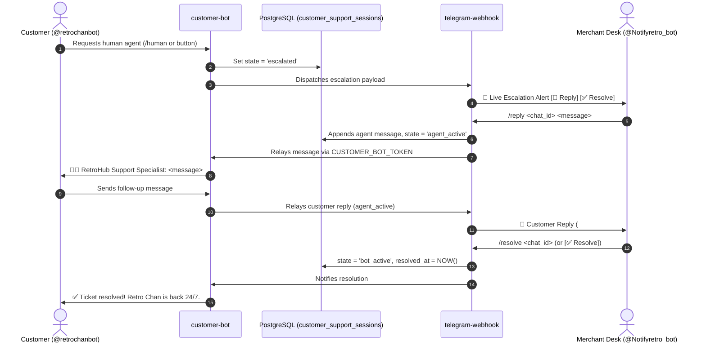

# 🛡️ RetroHub Staff & Admin Bot (Notifyretro)

<p align="center">
  
</p>

<p align="center">
  <b>Internal Merchant Operations, Order Dispatch & Live Support Relay Engine</b><br>
  <i>Engineered with Deno, Supabase Edge Functions, and Telegram Bot API.</i>
</p>

<p align="center">
  
  
  
  
</p>

---

## 📖 Executive Summary

The **Admin Webhook (`telegram-webhook`)** serves as the internal command center and mobile control terminal for the RetroHub merchant desk (`@Notifyretro_bot`). 

Unlike the customer-facing AI concierge, this function is strictly role-gated for merchant operations. It provides:
1. **Real-time Push Alerts**: Instant push alerts on smartphone/desktop for new orders, customer bKash Transaction ID submissions, duplicate payment fraud detections, unlisted custom orders, and low-inventory warnings.
2. **Mobile ERP Terminal**: Complete suite of `/` commands allowing the merchant to verify payments, fulfill digital keys, pause orders, cancel/refund, and audit margins on-the-go without opening the web dashboard.
3. **Bidirectional Live Support Relay**: Enables staff to view escalated customer inquiries (`/tickets`), reply directly into the customer's Telegram chat (`/reply <chat_id> <message>`), and resolve tickets (`/resolve <chat_id>`), seamlessly bridging staff with `@retrochanbot`.
4. **Internal Event Dispatcher**: Accepts authenticated internal HTTP `POST` requests from the RetroHub frontend and background cron runners (`deploy-pages.yml`, `pending-orders-reminder.yml`).

---

## 🚀 Deployment Playbook

### 1. Deploy the Edge Function

```bash
npx supabase functions deploy telegram-webhook --no-verify-jwt
```

### 2. Register Webhook Dispatcher

Bind the webhook endpoint to Telegram with the cryptographic secret:

```powershell
Invoke-RestMethod -Uri "https://api.telegram.org/bot<YOUR_ADMIN_BOT_TOKEN>/setWebhook" -Method Post -Body @{
    url = "https://<YOUR_PROJECT_REF>.supabase.co/functions/v1/telegram-webhook"
    secret_token = "<YOUR_TELEGRAM_WEBHOOK_SECRET>"
}
```

---

## ⚡ Operational Command Reference

All merchant commands require the incoming Telegram chat ID to strictly match `ADMIN_CHAT_ID`. Unrecognized users receive no response.

| Command | Syntax | Description |
| :--- | :--- | :--- |
| `/orders` | `/orders` | Lists the 10 most recent pending and unfulfilled orders with total amounts and payment statuses. |
| `/order` / `/inspect` | `/order <order_id>` | Displays full order dossier: customer name, email, phone, game UID/server zone, TrxID, and items. |
| `/verify` | `/verify <order_id>` | Verifies customer payment (`status = 'payment_verified'`) and alerts the buyer. |
| `/deliver` | `/deliver <order_id> <code>` | Fulfills order with digital key/voucher, logs profit, unlocks code for buyer, and triggers Resend email. |
| `/cancel` | `/cancel <order_id> [reason]` | Cancels order, releases any locked inventory keys, and logs admin action. |
| `/hold` | `/hold <order_id> [reason]` | Puts order on hold (e.g., incorrect Player UID or missing server zone). |
| `/refund` | `/refund <order_id> [reason]` | Transitions order status to refunded. |
| `/summary` | `/summary` | Financial snapshot: Today's gross revenue (৳), net profit margin, order count, and pending backlog. |
| `/stock` | `/stock [query]` | Real-time inventory audit across digital products, highlighting items with low or zero stock. |
| `/custom` | `/custom` | Lists open on-demand custom procurement requests submitted via `/custom-order`. |
| `/remind` | `/remind` | Triggers an immediate scan for pending orders older than 2 hours requiring action. |
| `/tickets` / `/support` | `/tickets` | Lists all customer support sessions currently in `escalated` or `agent_active` state. |
| `/reply` | `/reply <chat_id> <message>` | Relays a message directly to the customer in `@retrochanbot` and switches ticket to `agent_active`. |
| `/resolve` | `/resolve <chat_id>` | Closes support ticket, transitions session to `bot_active`, and notifies customer that Retro Chan AI is back. |
| `/help` | `/help` | Complete operational command reference manual. |

---

## 🔘 Inline Keyboard Actions

Notifications dispatched by the bot include interactive inline buttons for rapid execution:

- `[🔍 Inspect]` — Direct lookup of order details.
- `[✅ Verify Payment]` — One-touch verification for bKash transaction alerts.
- `[❌ Cancel Order]` — Instant cancellation.
- `[💬 Reply]` — Quick command template generator for live support escalation alerts.
- `[✅ Mark Resolved]` — One-touch ticket closure returning the customer back to AI mode.

---

## 🤝 Bidirectional Live Support Relay Sequence

When a customer explicitly requests human assistance in `@retrochanbot`, the two bots orchestrate a live relay:



---

## 🛡️ Security & Defensive Invariants

1. **Strict Admin Verification**: Checks `chat.id.toString() === ADMIN_CHAT_ID` on every incoming command. Non-matching chat IDs are immediately discarded.
2. **Cryptographic Header Verification**: Validates `X-Telegram-Bot-Api-Secret-Token` against `TELEGRAM_WEBHOOK_SECRET` for all incoming webhook calls.
3. **HTML Sanitization**: All customer inputs, game titles, and error messages are passed through `escapeHtml()` prior to Telegram Markdown/HTML formatting to prevent injection vulnerabilities.
4. **Internal Event Authentication**: Direct programmatic calls from the application are verified via `X-Internal-Secret` or Supabase service role headers.

---

## ⚙️ Environment Secrets Vault

Ensure these secrets are configured in Supabase (**Project Settings -> Edge Functions -> Secrets**):

| Secret | Value Type | Description |
| :--- | :--- | :--- |
| `TELEGRAM_BOT_TOKEN` | `string` | Primary token for `@Notifyretro_bot` from BotFather. |
| `ADMIN_CHAT_ID` | `string` | Merchant's Telegram chat or group ID. |
| `CUSTOMER_BOT_TOKEN` | `string` | Token for `@retrochanbot`, used to relay `/reply` messages to buyers. |
| `TELEGRAM_WEBHOOK_SECRET` | `string` | Cryptographic secret verified against incoming Telegram webhook requests. |
| `SUPABASE_URL` | `string` | Injected automatically by the Supabase Edge runtime. |
| `SUPABASE_SERVICE_ROLE_KEY` | `string` | Injected automatically by the Supabase Edge runtime. |

---

## 📄 License

Private & Proprietary — Developed for RetroHub E-Commerce. All rights reserved.  
© 2026 RETROHUB — Engineered by **Abir Hossain**.
