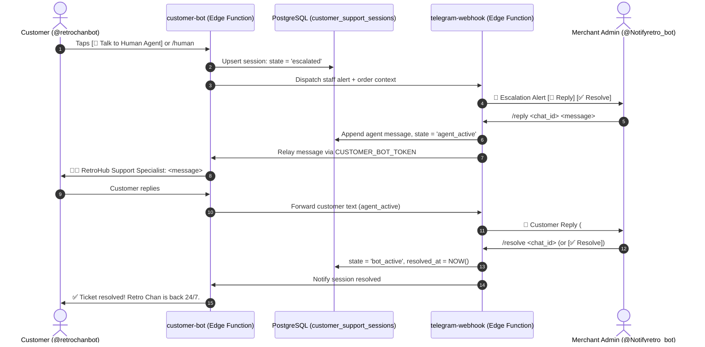

# RetroHub Backend & Supabase Architecture ⚡🗄️

<p align="center">
  
</p>

<p align="center">
  <b>Enterprise-Grade Database, Edge Compute, & Access Control</b><br>
  <i>Engineered with PostgreSQL 15, Deno Edge Functions, and Row-Level Security.</i>
</p>

<p align="center">
  
  
  
</p>

---

## 📖 Executive Summary

Comprehensive technical documentation for RetroHub's database schema, versioned migrations, stored procedures, Edge Functions, Row-Level Security, and dual Telegram bot integrations.

---

## 📁 Directory Structure

```
supabase/
├── functions/
│   ├── customer-bot/        # 24/7 AI Customer Support Bot (Retro Chan @retrochanbot)
│   ├── telegram-webhook/    # 24/7 Merchant Admin Bot (@Notifyretro_bot)
│   └── send-order-email/    # Resend order fulfillment email edge function
├── migrations/              # 29 versioned PostgreSQL migrations
└── README.md                # This manual
```

---

## ⚡ Edge Functions Overview

### 1. `customer-bot` — AI Customer Support Bot (`@retrochanbot`)

A public-facing Telegram support agent powered by a **Dual-Engine Architecture**: **xAI Grok** (`grok-2-latest`, `grok-2`, `grok-beta`) combined with a built-in **Retro Chan Natural Intelligence Engine**, connected directly to the RetroHub PostgreSQL database.

- **Dual-Engine Architecture**:
  - **Primary (xAI Grok)**: Context-aware conversational AI with dynamic store prompt injection and active order state tracking.
  - **Secondary (Retro Chan Natural Intelligence Engine)**: High-speed local store intelligence answering bKash payment walkthroughs, instant delivery guarantees, order status queries, and product catalog details with zero external API dependencies.
- **Zero-Interruption Invariant**: The merchant admin bot is **only alerted when a customer explicitly requests human assistance** (via `[👤 Talk to Human Agent]`, `/human`, `/agent`, `/support`, `/staff`). General customer care inquiries never ping or bother the merchant desk.
- **Instant Order Tracking**: Accepts short IDs (e.g. `8f4b12`), 36-char UUIDs, or user email addresses to display live order status, verification stage, item breakdowns, and delivered digital codes.
- **bKash Payment Assistant**: Step-by-step payment walkthrough for bKash Send Money to `01580382868`, explaining the dynamic 1.0% charge calculation and reference ID.
- **Multi-Turn Session Persistence**: Persists user interactions in the `customer_support_sessions` table with automated 20-message rolling memory.
- **Self-Resume & Cancellation**: Customers can tap `[🤖 Resume with Retro Chan AI]` at any time to return to autonomous AI mode.
- **Registered Menu Commands**: `/start`, `/track [id]`, `/faq`, `/help`, `/human`.

```bash
# Deploy customer bot
npx supabase functions deploy customer-bot --no-verify-jwt
```

---

### 2. `telegram-webhook` — Merchant Admin Bot (`@Notifyretro_bot`)

A private, role-gated back-office bot configured for instant smartphone order fulfillment, real-time merchant alerts, and customer support relay.

- **Dual-Channel Dispatch Architecture**: Dispatched via this edge function with automatic direct client fallback to ensure notifications are never missed during cold starts.
- **Push Notifications**: Pushes new order alerts, customer bKash TrxID submissions with duplicate fraud detection, custom quote alerts, and low stock warnings (≤ 3 units).
- **Interactive Fulfillment Commands**:
  - `/orders` — View up to 10 latest unfulfilled orders
  - `/order <id>` or `/inspect <id>` — Inspect full order details
  - `/verify <id>` — Verify customer bKash payment (`status = 'payment_verified'`)
  - `/deliver <id> <code>` — Fulfill order with license key or account credentials
  - `/cancel <id> [reason]` — Cancel order and release reserved stock
  - `/hold <id> [reason]` — Pause order (e.g., incorrect Player UID)
  - `/refund <id> [reason]` — Mark order as refunded
  - `/summary` — Today's revenue, net profit, orders, and pending items
  - `/stock [search]` — Live inventory health report
  - `/custom` — Review custom quote requests
  - `/remind` — Trigger immediate scan for unfulfilled orders
  - `/help` — Full command reference manual
- **Live Customer Support Commands**:
  - `/tickets` or `/support` — View open customer support requests requiring human assistance
  - `/reply <chat_id> <message>` — Send a live message directly to a customer on `@retrochanbot`
  - `/resolve <chat_id>` — Mark customer support ticket as resolved and return session to AI
- **Inline Keyboards**: One-touch `Verify`, `Cancel`, `Inspect`, `Reply`, and `Resolve` buttons directly under notifications.

```bash
# Deploy admin bot webhook
npx supabase functions deploy telegram-webhook --no-verify-jwt
```

---

### 3. `send-order-email` — Customer Order Notification

Connects to the **Resend API** to email digital codes, receipts, and platform redemption instructions directly to the buyer's email address upon order fulfillment.

```bash
# Deploy email function
npx supabase functions deploy send-order-email --no-verify-jwt
```

---

## 🤝 Bidirectional Live Support Relay Sequence

When a customer explicitly requests human assistance in `@retrochanbot`, the two bots orchestrate a live relay:



---

## 🗄️ Database Architecture & Migrations

The database runs on **PostgreSQL 15+** managed via 29 versioned SQL migrations in `supabase/migrations/`:

| Migration Series | Scope & Purpose                                                                                                                                                                                                                                                                                                                                                                                                                                                                                                                                                                                                                                                 |
| :--------------- | :-------------------------------------------------------------------------------------------------------------------------------------------------------------------------------------------------------------------------------------------------------------------------------------------------------------------------------------------------------------------------------------------------------------------------------------------------------------------------------------------------------------------------------------------------------------------------------------------------------------------------------------------------------------- |
| `20260208*`      | Initial core schema: `products`, `orders`, `profiles`, `inventory_keys`, `user_roles`.                                                                                                                                                                                                                                                                                                                                                                                                                                                                                                                                                                          |
| `20260917*`      | V2 schema refactoring: relational integrity, foreign keys, and status enums.                                                                                                                                                                                                                                                                                                                                                                                                                                                                                                                                                                                    |
| `20260919*`      | Performance indexes V3, missing regional taxonomies, and `SECURITY DEFINER` function security fixes.                                                                                                                                                                                                                                                                                                                                                                                                                                                                                                                                                            |
| `20260920*`      | Custom order requests board (`custom_orders` table) and database linter resolutions.                                                                                                                                                                                                                                                                                                                                                                                                                                                                                                                                                                            |
| `20260924*`      | Added `service` and `accounts` categories; default `instant_code` delivery pipeline flag.                                                                                                                                                                                                                                                                                                                                                                                                                                                                                                                                                                       |
| `20260927*`      | **Current V3 Architecture**: <br>• `20260927000001_secure_order_payment_and_pricing.sql` — Secure payment RPC + price tamper validation<br>• `20260927000002_customer_support_sessions.sql` — Multi-turn AI support session tracking table with RLS<br>• `20260927000003_fix_security_linter_warnings.sql` — Resolved RLS and function search path linter findings<br>• `20260927000004_fix_database_linter_performance_warnings.sql` — Added missing foreign key indexes<br>• `20260927000005_drop_safe_unused_indexes.sql` — Dropped redundant unused indexes<br>• `20260927000006_drop_obsolete_stock_validation.sql` — Cleaned up deprecated stock triggers |

---

## 🛡️ Security Definer RPCs & Stored Procedures

Clients access sensitive mutations exclusively through audited `SECURITY DEFINER` functions:

| Procedure              | Parameters                                                                               | Role & Security Invariant                                                                                                                                               |
| :--------------------- | :--------------------------------------------------------------------------------------- | :---------------------------------------------------------------------------------------------------------------------------------------------------------------------- |
| `submit_order_payment` | `p_order_id`, `p_payment_method`, `p_transaction_id`, `p_payment_phone`, `p_amount_paid` | Validates that caller owns the order (`user_id = auth.uid()`), checks transaction ID format, ensures exact amount match, and transitions status to `payment_submitted`. |
| `has_role`             | `_user_id`, `_role`                                                                      | Checks whether the authenticated user possesses an administrative role in `user_roles`.                                                                                 |
| `verify_payment`       | `p_order_id`, `p_admin_id`                                                               | Verifies payment and moves order to `payment_verified`. Restricted to `admin` role.                                                                                     |
| `fulfill_order`        | `p_order_id`, `p_code`, `p_cost_price`, `p_supplier`                                     | Fulfills order, unlocks code, logs profit margin, and transitions status to `fulfilled`. Restricted to `admin` role.                                                    |
| `cancel_order`         | `p_order_id`, `p_reason`, `p_admin_id`                                                   | Cancels order, releases any locked inventory keys, and logs action. Restricted to `admin` role.                                                                         |
| `hold_order`           | `p_order_id`, `p_reason`, `p_admin_id`                                                   | Puts order on hold due to missing details. Restricted to `admin` role.                                                                                                  |
| `refund_order`         | `p_order_id`, `p_reason`, `p_admin_id`                                                   | Issues refund state change. Restricted to `admin` role.                                                                                                                 |

---

## 🔒 Row-Level Security (RLS) Matrix

| Table                       | Anonymous / Guest      | Authenticated Customer          | Admin Role | Service Role Key |
| :-------------------------- | :--------------------- | :------------------------------ | :--------- | :--------------- |
| `products`                  | `SELECT` (active only) | `SELECT` (active only)          | `ALL`      | `ALL`            |
| `orders`                    | `INSERT` (new orders)  | `SELECT`, `INSERT` (own orders) | `ALL`      | `ALL`            |
| `inventory_keys`            | None                   | None                            | `ALL`      | `ALL`            |
| `customer_support_sessions` | None                   | `SELECT` (own chat session)     | `ALL`      | `ALL`            |
| `custom_orders`             | `INSERT`               | `SELECT`, `INSERT` (own quotes) | `ALL`      | `ALL`            |
| `admin_action_logs`         | None                   | None                            | `SELECT`   | `ALL`            |

---

## 📊 Analytical Views

Real-time aggregate views powers the `/admin` merchant dashboard:

- `v_revenue_today`: Sum of gross transaction values for orders fulfilled or verified today.
- `v_orders_today`: Total orders placed today.
- `v_profit_today`: Real-time net margin: $\sum (\text{Sale Price} - \text{Cost Price})$.
- `v_pending_action_count`: Live counter of orders awaiting verification or fulfillment.

---

## 🔐 Required Supabase Secrets

Set these in your Supabase project dashboard (**Project Settings -> Edge Functions -> Secrets**) or via CLI:

```bash
# Telegram Bot Tokens
TELEGRAM_BOT_TOKEN="your_admin_bot_token"
ADMIN_CHAT_ID="your_telegram_chat_id"
CUSTOMER_BOT_TOKEN="your_customer_bot_token"

# Webhook Security
TELEGRAM_WEBHOOK_SECRET="your_webhook_secret_token"

# AI Integration
XAI_API_KEY="your_xai_api_key"

# Email Delivery
RESEND_API_KEY="your_resend_api_key"
```

To configure via Supabase CLI:

```bash
npx supabase secrets set TELEGRAM_BOT_TOKEN="xxx" ADMIN_CHAT_ID="xxx" CUSTOMER_BOT_TOKEN="xxx" XAI_API_KEY="xxx"
```

---

## 📄 License

Private & Proprietary — Developed for RetroHub E-Commerce. All rights reserved.  
© 2026 RETROHUB — Engineered by **Abir Hossain**.
