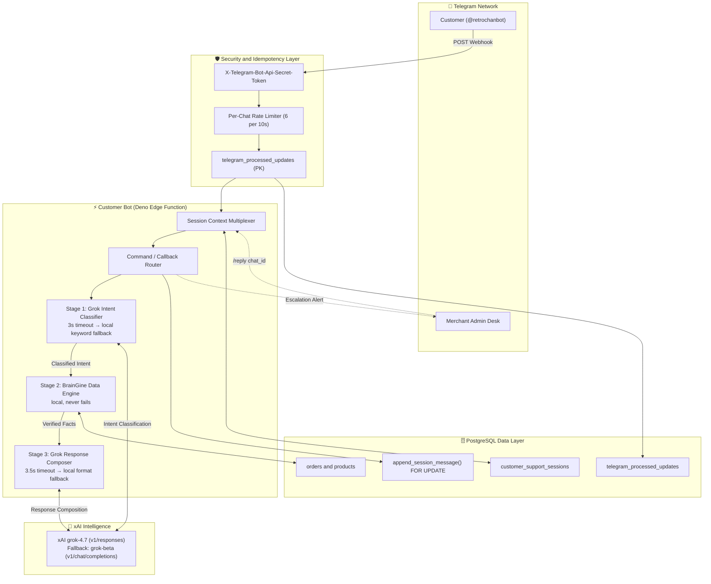

# 🤖 RetroHub Customer Support Bot (Retro Chan)

<p align="center">
  
</p>

<p align="center">
  <b>Enterprise-Grade AI Telegram Concierge &amp; Digital Goods Delivery Engine</b><br>
  <i>Engineered with Deno, xAI Grok 4.7 Three-Stage Pipeline, and Supabase Edge Functions.</i>
</p>

<p align="center">
  
  
  
  
</p>

---

## 📖 Executive Summary

**Retro Chan (@retrochanbot)** is the front-line Customer Support AI for the RetroHub commerce platform. Operating 24/7 inside Telegram, this bot handles level-1 triage, instant order tracking, digital key delivery, and comprehensive bKash payment walkthroughs — fully autonomously.

It implements a **Three-Stage AI Pipeline** — **Grok Classifier → BrainGine Data Engine → Grok Composer** — combining the contextual intelligence of **xAI Grok 4.7** with a zero-dependency local fallback at every stage to guarantee zero downtime.

Furthermore, this edge function is meticulously **hardened** against Telegram network races and double-execution edge cases using PostgREST row-level locks, per-chat rate limiting, and cryptographic webhook secret validation.

---

## 🚀 Deployment Playbook

### 1. Deploy the Edge Function

Ship the finalized code to the Supabase Edge infrastructure:

```bash
npx supabase functions deploy customer-bot --no-verify-jwt
```

### 2. Register Webhook Dispatcher

Bind the webhook endpoint to Telegram with the cryptographic secret:

```powershell
Invoke-RestMethod -Uri "https://api.telegram.org/bot<YOUR_CUSTOMER_BOT_TOKEN>/setWebhook" -Method Post -Body @{
    url = "https://<YOUR_PROJECT_REF>.supabase.co/functions/v1/customer-bot"
    secret_token = "<YOUR_TELEGRAM_WEBHOOK_SECRET>"
}
```

---

## 🏛️ System Architecture Topology



---

## ⚡ Core Features & Capabilities

### 1. Three-Stage AI Pipeline

Every customer message flows through three distinct, independently resilient stages:

| Stage | Name | Primary Engine | Fallback | Timeout |
|:---:|:---|:---|:---|:---|
| **1** | **Intent Classifier** | xAI `grok-4.7` (JSON mode) | `classifyIntentLocally()` keyword matcher (<1ms) | 3s |
| **2** | **BrainGine Data Engine** | Pure local — Supabase DB queries | N/A — always succeeds | None |
| **3** | **Response Composer** | xAI `grok-4.7` (Retro Chan persona) | `formatBrainGineResponse()` structured HTML | 3.5s |

**Key design principle:** BrainGine (Stage 2) is the single source of truth. Grok (Stage 3) is only a *stylist* — it cannot invent prices, stock levels, or order statuses. All verified facts are passed as a sealed payload from Stage 2. The **Intent Classifier** (Stage 1 & local fallback) natively understands English, Banglish (e.g., "koto dam", "ache naki", "lagbe"), and regional gaming context.

### 2. BrainGine — Local Intelligence Engine

The zero-dependency data retrieval engine handles all 9 intent categories:

- **`product_search`** — Multi-vector fuzzy search engine scoring by exact phrase, token coverage, and platform intent. Features extensive alias expansion (`gtav` → GTA 5, `vp` → Valorant Points, `fc25` → EA FC 25) and gracefully falls back to **Custom On-Demand Game Sourcing** proposals for out-of-catalog inquiries.
- **`order_status`** — Fetches live order status from Supabase with inline interactive keyboards (`[📦 Check Status]` / `[🔑 View Key / Code]`).
- **`payment_help`** — Returns verified bKash number, fee structure, and verification URL.
- **`delivery_info`** — Explains the 1–15 minute automated SLA post-payment-verification.
- **`complaint`** — Returns the refund/replacement guarantee policy and escalation path.
- **`human_request`** — Short-circuits to local format and immediately triggers staff escalation.
- **`greeting`** — Returns live featured products alongside the store overview.
- **`thanks`** — Local closing response, Grok skipped entirely (no token cost).
- **`general_question`** — Returns the store overview and capability summary.

### 3. Autonomous Digital Delivery Engine

- **Order Parsing**: Detects exact 8-character short IDs or full UUIDs in conversation. Ambiguous prefix matches (more than 1 collision) are rejected with a request for the full ID, eliminating silent data exposure.
- **Inline Keyboards**: Automatically mounts `[📦 Check Status]`, `[🔑 View Key / Code]`, `[⚠️ Report Issue]`, `[👤 Talk to Human Agent]` buttons on all order summaries.
- **Instant Key Reveal**: Unveils redeemed game keys and digital credentials in-chat from the `deliveries` or `final_output` fields.

### 4. Hardened Security & Resilience

- **Webhook Authentication**: Every incoming request is validated against `TELEGRAM_WEBHOOK_SECRET` via the `X-Telegram-Bot-Api-Secret-Token` header. Forged requests receive a `401 Unauthorized`.
- **Idempotency**: The `telegram_processed_updates` table ensures at-least-once Telegram delivery is executed exactly-once. Claims are released on processing failure so genuine retries succeed.
- **Session Row-Level Locking**: `append_session_message()` uses `SELECT … FOR UPDATE` to serialize concurrent message appends, preventing race-condition-induced history loss.
- **Per-Chat Rate Limiting**: A sliding window allows max 6 messages per 10 seconds per chat, blunting abuse and runaway bot loops.
- **Strict Order Security**: Order lookups require the full 8-character ID. Multiple matches return `ambiguous: true` instead of silently exposing the wrong order.
- **Upsert Session Creation**: Race conditions on concurrent first messages are handled via `upsert` with `onConflict: "chat_id"`, with a read-retry fallback.

### 5. Seamless Human Handoff Bridge

- **Zero-Interruption**: The AI manages 100% of the conversation autonomously until explicitly triggered.
- **Escalation Triggers**: `/human`, `/help`, `/agent`, `/staff`, `/support` commands, or the `[👤 Talk to Human Agent]` inline button.
- **State Machine**: Session transitions `bot_active` → `escalated` → `agent_active` → `bot_active` (via `/resolve`).
- **Admin Relay**: The merchant desk receives a formatted alert including the customer name, Chat ID, linked order, and a `/reply <chat_id>` command template. When the agent replies, the session upgrades to `agent_active`, creating a bidirectional bridge.

---

## 🗄️ Database Prerequisites

### `append_session_message` — Row-Locked History Append

```sql
create or replace function append_session_message(
  p_chat_id bigint,
  p_message jsonb,
  p_max_messages int default 8
) returns void
language plpgsql
set search_path = ''
as $$
declare
  v_combined jsonb;
  v_len int;
begin
  select coalesce(recent_messages, '[]'::jsonb) || jsonb_build_array(p_message)
    into v_combined
    from public.customer_support_sessions
    where chat_id = p_chat_id
    for update;

  v_len := jsonb_array_length(v_combined);

  update public.customer_support_sessions
  set recent_messages = (
        select jsonb_agg(value order by ord)
        from jsonb_array_elements(v_combined) with ordinality as t(value, ord)
        where ord > greatest(v_len - p_max_messages, 0)
      ),
      updated_at = now()
  where chat_id = p_chat_id;
end;
$$;
```

### `telegram_processed_updates` — Idempotency Table

```sql
create table if not exists public.telegram_processed_updates (
  update_id bigint primary key,
  claimed_at timestamptz default now()
);
```

---

## ⚙️ Environment Secrets Vault

Ensure these are populated in your Supabase Secrets manager (`npx supabase secrets set`):

| Secret | Value Type | Description |
| :--- | :--- | :--- |
| `CUSTOMER_BOT_TOKEN` | `string` | Primary bot token from BotFather for `@retrochanbot`. |
| `ADMIN_BOT_TOKEN` | `string` | Merchant admin bot token for `@Notifyretro_bot` (escalation alerts). |
| `STAFF_CHAT_ID` | `string` | Telegram Admin Chat / Group ID to route staff alert messages. |
| `XAI_API_KEY` | `string` | xAI Grok secret API Bearer token (must start with `xai-`). |
| `XAI_TEAM_ID` | `uuid` | Optional xAI Team/Organization ID for API scoping. |
| `TELEGRAM_WEBHOOK_SECRET` | `string` | Cryptographic secret verified against `X-Telegram-Bot-Api-Secret-Token` header. |

> `SUPABASE_URL` and `SUPABASE_SERVICE_ROLE_KEY` are injected automatically by the Supabase Edge runtime.

---

_Developed for RetroHub E-Commerce. Powered by Deno, xAI Grok 4.7 & Supabase._
