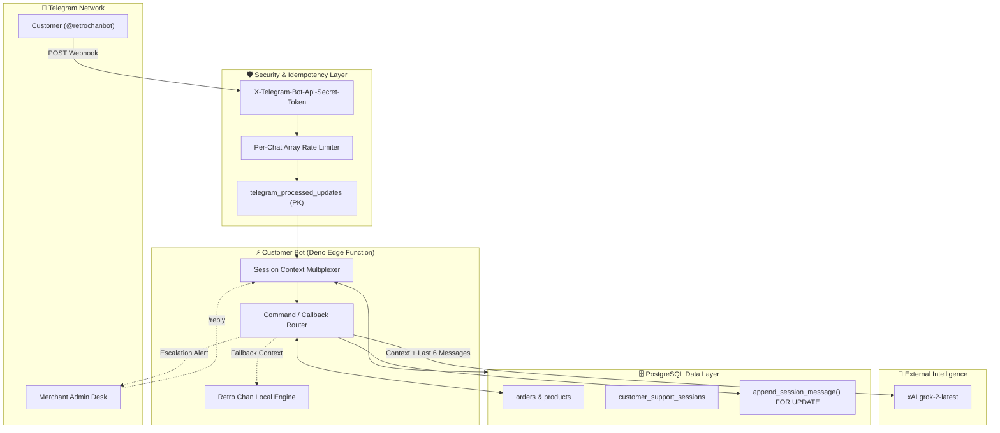

# 🤖 RetroHub Customer Support Bot (Retro Chan)

<p align="center">
  
</p>

<p align="center">
  <b>Enterprise-Grade AI Telegram Concierge & Digital Goods Delivery Engine</b><br>
  <i>Engineered with Deno, xAI Grok (grok-2-latest), and Supabase Edge Functions.</i>
</p>

<p align="center">
  
  
  
  
</p>

---

## 📖 Executive Summary

**Retro Chan (@retrochanbot)** is the front-line Customer Support AI for the RetroHub commerce platform. Operating 24/7 inside Telegram, this bot handles level-1 triage, instant order tracking, digital key delivery, and comprehensive bKash payment walkthroughs.

It implements a **Dual-Engine Architecture**—relying on **xAI (Grok-2)** for deeply contextual, empathetic conversational support, seamlessly backed by an ultra-fast **Deterministic Knowledge Engine** to ensure zero downtime during API outages.

Furthermore, this edge function is meticulously **hardened** against Telegram network races and double-execution edge cases using PostgREST row-level locks and webhook secret validation.

---

## 🏛️ System Architecture Topology



---

## ⚡ Core Features & Capabilities

### 1. Dual-Engine Conversational AI

- **Engine A (xAI Grok)**: Powered by modern `v1/responses` with `grok-4.7` (with fallback to `chat/completions` on `grok-beta`). Injects live product catalog items and active order contexts natively into the system prompt for highly contextual interactions. Gamified and enthusiastic tone (GG, GLHF).
- **Engine B (Retro Chan Natural Intelligence)**: Zero-downtime deterministic and live database catalog responder. Directly queries the `products` table (2,600+ active items) to answer exact game availability queries, in-stock prices, and custom on-demand game sourcing requests with zero latency and zero token costs.

### 2. Autonomous Digital Delivery Engine

- **Order Parsing**: Detects 8-character short IDs natively in conversation to track live orders.
- **Inline Keyboards**: Automatically mounts interactive `[📦 Check Status]` and `[🔑 View Key / Code]` buttons to order summaries.
- **Instant Reveal**: Unveils redeemed game keys and digital credentials directly in the chat interface via `final_output` and `deliveries` tables.

### 3. Hardened Security & Resilience

- **Idempotency Execution**: Telegram's at-least-once delivery is countered by the `telegram_processed_updates` table, ensuring a request is executed exactly once.
- **Session Row-Level Locking**: High-velocity messages are safely serialized into the chat history array using `append_session_message()`, preventing race conditions and lost history.
- **Strict Order Segregation**: Prefix scanning collisions are eliminated. Order tracking requires exact matches of the 8-character ID.
- **Webhook Signature**: Prevents unauthorized API invocation via `TELEGRAM_WEBHOOK_SECRET` validation.

### 4. Seamless Human Handoff Bridge

- **Zero-Interruption**: The AI manages 100% of the conversation unless explicitly told otherwise.
- **Admin Handoff**: Triggers via `/human` or `[🚨 Connect to Human Support]`. Pauses the AI (`escalated` state) and relays chat to the merchant desk.
- **Live Relay**: The merchant can seamlessly reply through `@Notifyretro_bot` using `/reply <chat_id>`, creating a bidirectional bridge until they fire `/resolve`.

---

## ⚙️ Environment Secrets Vault

Ensure these are populated in your Supabase Secrets manager (`npx supabase secrets set`):

| Secret                    | Value Type | Description                                                      |
| :------------------------ | :--------- | :--------------------------------------------------------------- |
| `CUSTOMER_BOT_TOKEN`      | `string`   | The primary bot token provided by BotFather for `@retrochanbot`. |
| `ADMIN_CHAT_ID`           | `bigint`   | The Telegram Admin Group ID to route staff alerts.               |
| `XAI_API_KEY`             | `string`   | x.ai Grok secret API Bearer token (starts with `xai-`).           |
| `XAI_TEAM_ID`             | `uuid`     | Optional x.ai Team/Organization ID for API scoping.               |
| `TELEGRAM_WEBHOOK_SECRET` | `string`   | Cryptographic secret verified against incoming webhook headers.  |

_(Note: `SUPABASE_URL` and `SUPABASE_SERVICE_ROLE_KEY` are provided automatically by the Supabase runtime environment.)_

---

## 🚀 Deployment Playbook

### 1. Deploy the Edge Function

Ship the finalized code to the Supabase Edge infrastructure:

```bash
npx supabase functions deploy customer-bot --no-verify-jwt
```

### 2. Register Webhook Dispatcher

Bind the webhook endpoint to Telegram with the cryptographic secret:

```powershell
Invoke-RestMethod -Uri "https://api.telegram.org/bot<YOUR_CUSTOMER_BOT_TOKEN>/setWebhook" -Method Post -Body @{
    url = "https://<YOUR_PROJECT_REF>.supabase.co/functions/v1/customer-bot"
    secret_token = "<YOUR_TELEGRAM_WEBHOOK_SECRET>"
}
```

---

## 🗄️ Database Prerequisites

The function strictly requires the following PL/pgSQL function to prevent race conditions during rapid message bursts:

```sql
create or replace function append_session_message(
  p_chat_id bigint,
  p_message jsonb,
  p_max_messages int default 8
) returns void
language plpgsql
set search_path = ''
as $$
declare
  v_combined jsonb;
  v_len int;
begin
  select coalesce(recent_messages, '[]'::jsonb) || jsonb_build_array(p_message)
    into v_combined
    from public.customer_support_sessions
    where chat_id = p_chat_id
    for update;

  v_len := jsonb_array_length(v_combined);

  update public.customer_support_sessions
  set recent_messages = (
        select jsonb_agg(value order by ord)
        from jsonb_array_elements(v_combined) with ordinality as t(value, ord)
        where ord > greatest(v_len - p_max_messages, 0)
      ),
      updated_at = now()
  where chat_id = p_chat_id;
end;
$$;
```

---

_Developed for RetroHub E-Commerce. Powered by Deno & Supabase._
